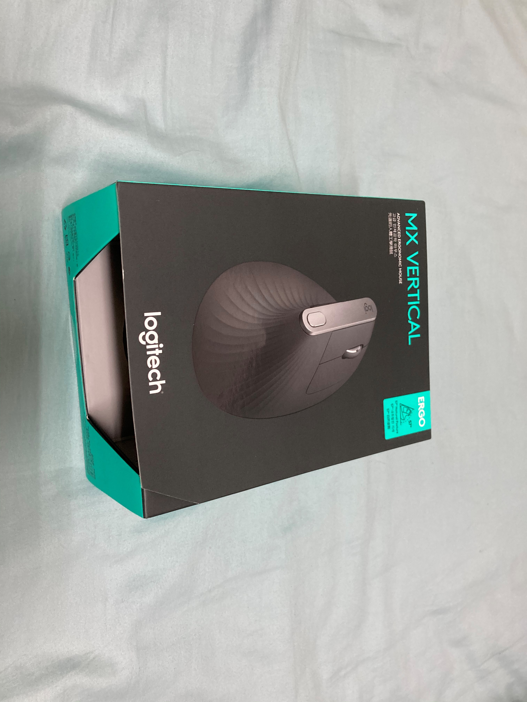
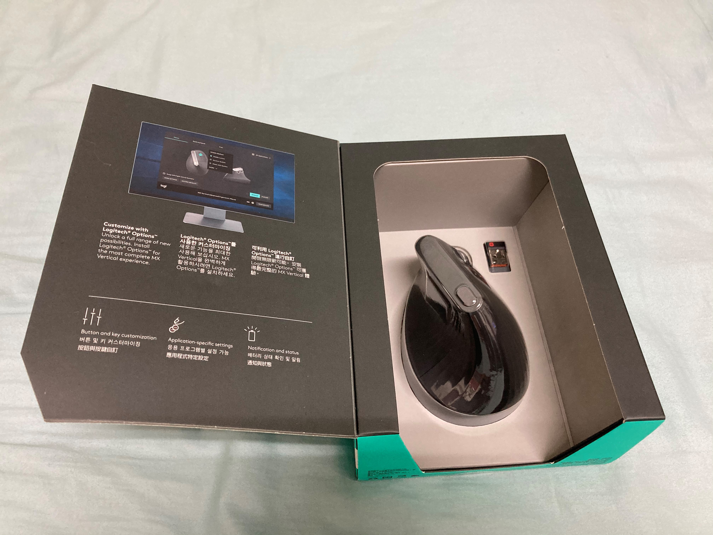
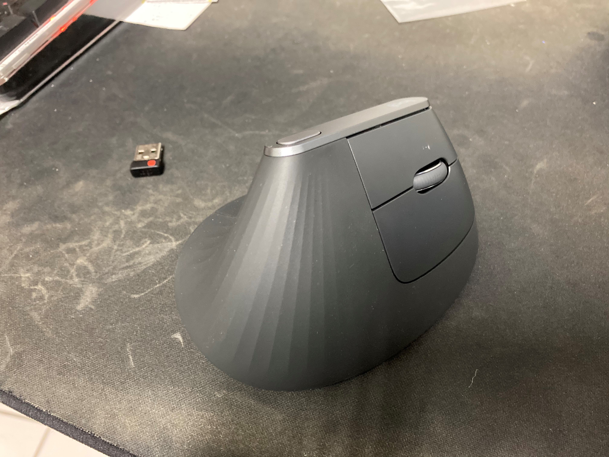
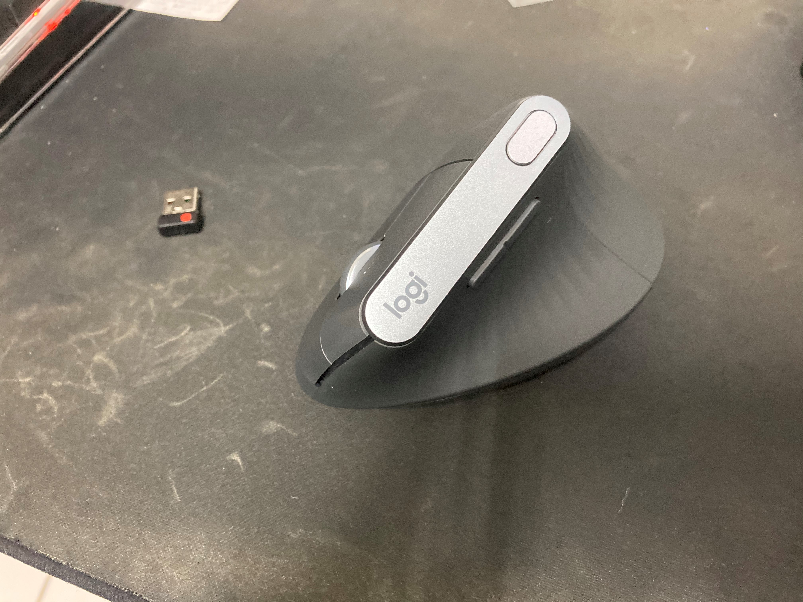
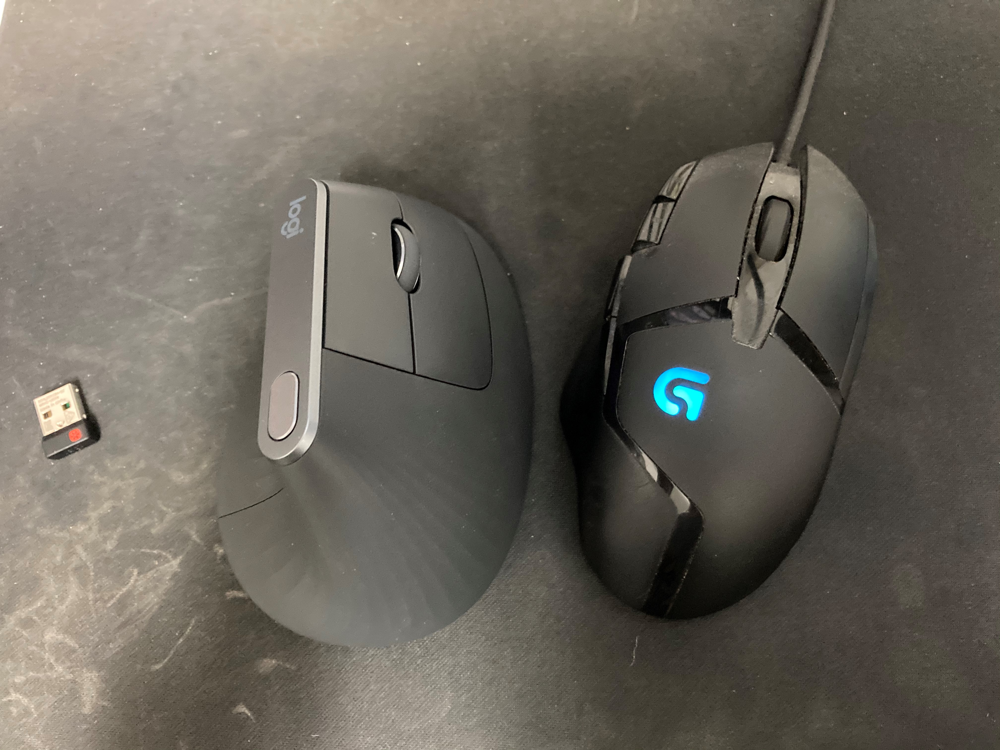
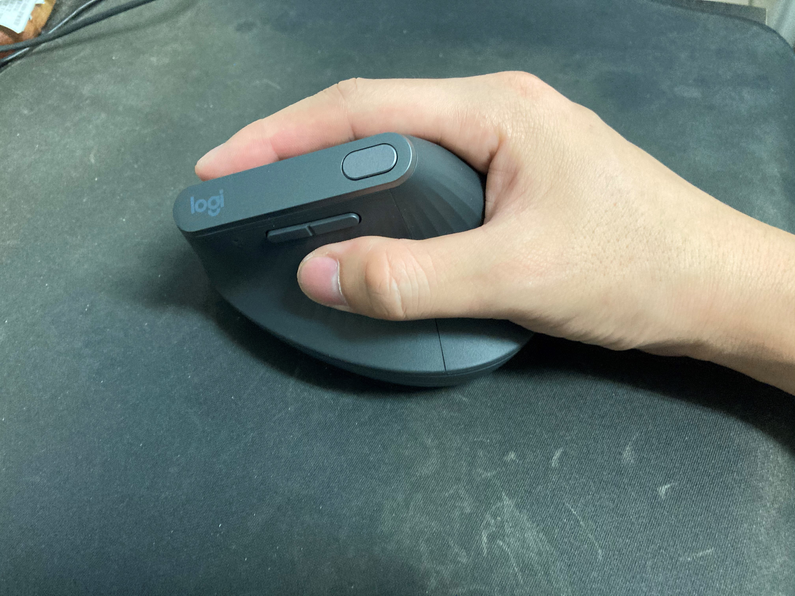

# Logitect MX Vertical

新買一隻特別的滑鼠，準備要在日常工作的時候用看看

<!--more-->

外盒

跟以前比起來，包裝變簡單了，也變的很好拆

內容物也很簡單，連說明書都沒有

反過來

跟目前在家使用的 G402 比比看

手握照

這隻初步握起來不是很習慣，跟平常用滑鼠的姿勢差很多，定位的感覺也不太一樣
目前在公司是用已經停產的 Logitech MX518 (好像又有復刻版)
MX Vertical 先帶到公司用個一兩週之後再看看怎樣，希望能減輕手部的負擔 🤔

這也是我第一次買無線滑鼠，希望不會後悔 XDD

## Reference
- https://www.logitech.com/zh-tw/product/mx-vertical-ergonomic-mouse

