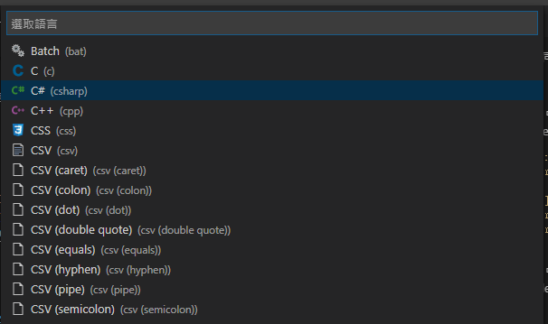

# Visual Studio Code 針對各語言用不同編輯器設定的方法


vscode 可以對不同語言用不同的設定，在某些情況下會比較方便

<!--more-->
---
## 設定方式 1

在 vscode 中按 `Ctrl + Shift + P` 輸入 `Open Settings` 打開 vscode 的設定檔，針對各語系加入設定  


```json
    "[csharp]":{
        "editor.tabSize": 4
    },
    "[markdown]":{
        "editor.wordWrap": "on",
        "editor.quickSuggestions": false
    }
```

## 設定方式 2
在 vscode 中按 `Ctrl + Shift + P` 輸入 `Configure Language Specific Settings`，再選擇要設定的語系，vscode 會幫你打開 `settings.json` 並加入對應的語系，再自行加入所需設定就可以  
  


## Reference
- https://code.visualstudio.com/docs/getstarted/settings#_language-specific-editor-settings

