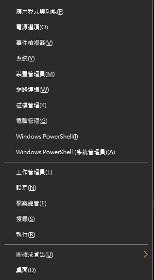
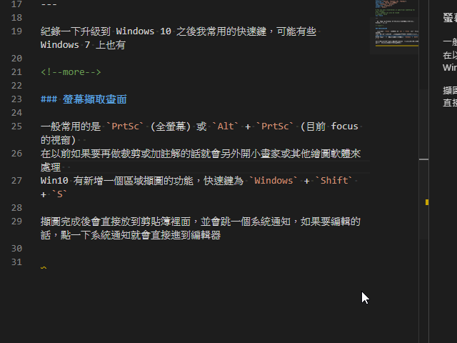
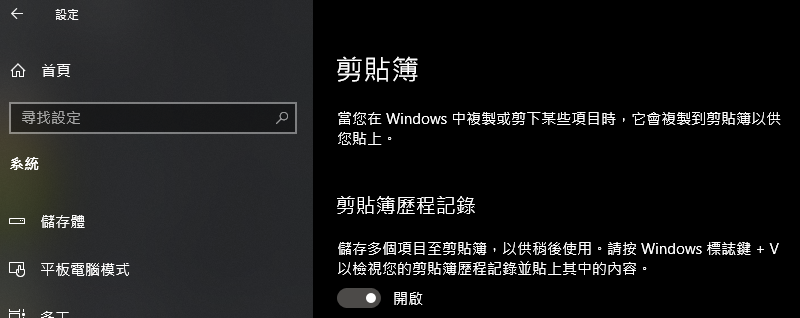
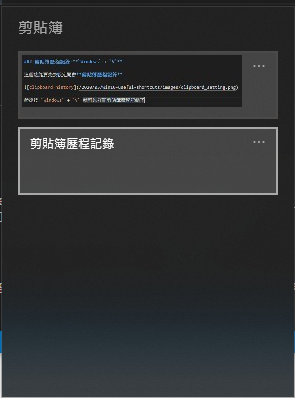
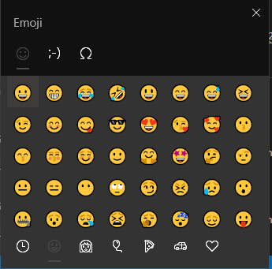

# Win10 常用快速鍵

紀錄一下升級到 Windows 10 之後我常用的快速鍵

<!--more-->

## 快速選單 **`Windows + x`**

可以從這個選單打開工作管理員、設定、事件檢視器等視窗

## 螢幕擷取畫面 **`Windows + Shift + S`**

一般常用的是 `PrtSc` (全螢幕) 或 `Alt + PrtSc` (目前 focus 的視窗)  
在以前如果要再做裁剪或加註解的話就會另外開小畫家或其他繪圖軟體來處理  
Win10 有新增一個區域擷圖的功能，快速鍵為 `Windows + Shift + S`

擷圖完成後會直接放到剪貼簿裡面，並會跳一個系統通知，如果要編輯的話，點一下系統通知就會直接進到編輯器

## 剪貼簿歷程記錄 **`Windows + V`**

這個功能要先去設定開啟**剪貼簿歷程記錄**

然後按 `Windows + V` 就可以打開剪貼簿歷程記錄了

## 虛擬桌面

Windows 終於內建虛擬桌面了

| 功能 | Shortcut |
| ---  | --- |
| 創建虛擬桌面        | `Windows + Ctrl + D`  |
| 關閉目前的虛擬桌面   | `Windows + Ctrl + F4` |
| 切換到下一個虛擬桌面 | `Windows + Ctrl + →`  |
| 切換到上一個虛擬桌面 | `Windows + Ctrl + ←`  |

另外 `Windows + Tab` 可以管理目前所有視窗及虛擬桌面，並可以把視窗拖曳到指定的虛擬桌面裡面

## Emoji 符號表 **`Windows + .`** 或 **`Windows + ;`**

就是開一個 Emoji 快速輸入表出來😎

## Reference
- https://support.microsoft.com/zh-tw/help/12445

