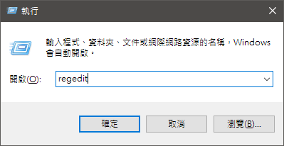
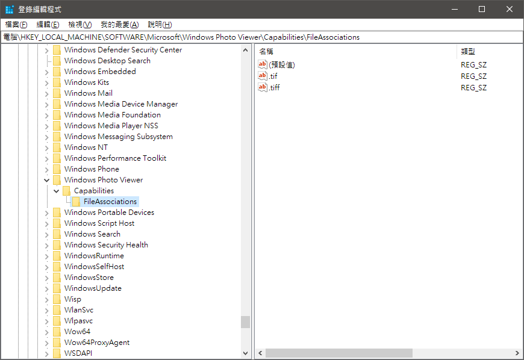
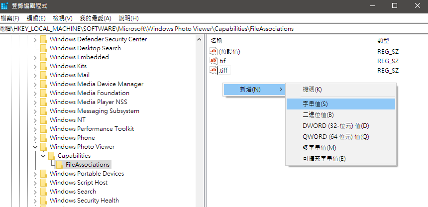
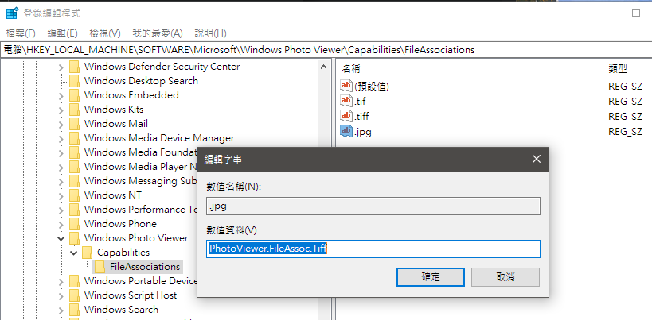
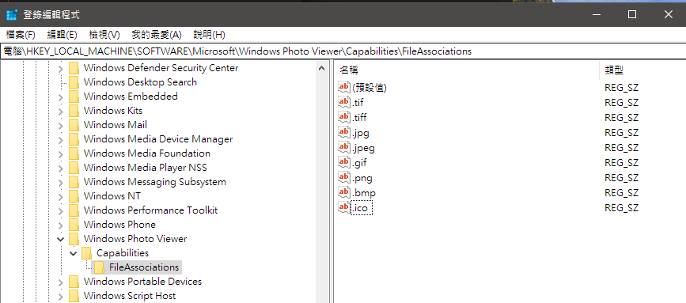
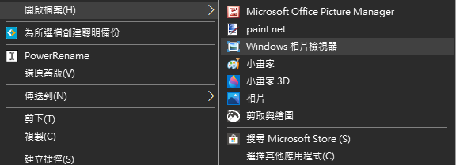
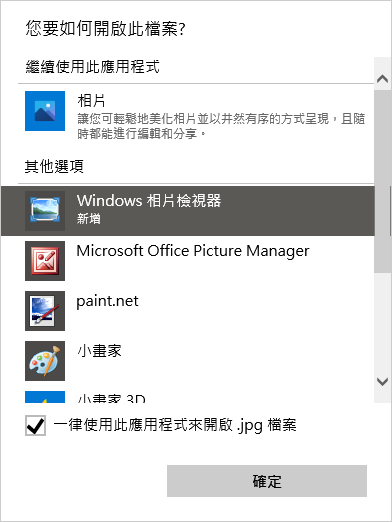

# Win10 改回舊版相片檢視器

升級到 Win10 後，總覺得預設的圖片開啟程式**相片**不是很習慣，想換回 Win7 的**相片檢視器**該怎麼做？

<!--more-->

## 詳細步驟

1. 按 `windows + r`，輸入 `regedit` 開啟登錄檔編輯器  
  

2. 切換到到路徑 `HKEY_LOCAL_MACHINE\SOFTWARE\Microsoft\Windows Photo Viewer\Capabilities\FileAssociations`  
  

3. 右鍵->新增->字串值  
  

4. 名稱輸入想要加入的照片格式副檔名，例如 `.jpg`，數值資料輸入 `PhotoViewer.FileAssoc.Tiff` 後按確定離開  
  

5. 重複步驟4，把想用舊版相片檢視器開啟的種類副檔案也加入，這邊總共新增了 `.jpg` `.jpeg` `.gif` `.png` `.bmp` `.ico`  
  

6. 接下來到檔案總管，對照片按右鍵->開啟檔案，就會看到可以用**Windows 相片檢視器**開啟了  
    
  

## 比較圖

  
比較圖片為放大 100% 的效果，左邊是 Win7 的**相片檢視器**，右邊是 Win10 的**相片**，可以發現 Win10 的放大應該是用雙線性或三線性縮放處理過，比較平滑，而 Win7 是直接線性縮放，照片會呈現格子狀

