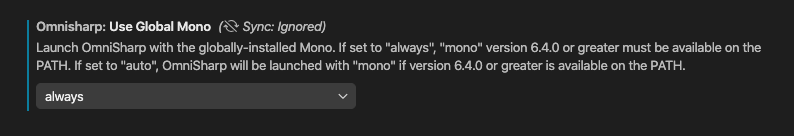

# MacOSX 上的 VSCode 開啟 mono 專案，C# Extension 跑出找不到 .NET Framework 4.7.1 的錯誤


MacOS 上要先安裝 .NET Core SDK 及 Mono 才能使用 VSCode 打開 mono/.NET 專案，但安裝後 VSCode 的 C# Extension 還是跳錯誤訊息

<!--more-->

## 症狀

VSCode 錯誤訊息如下

```text
[fail]: OmniSharp.MSBuild.ProjectLoader
        The reference assemblies for .NETFramework,Version=v4.7.1 were not found. To resolve this, install the Developer Pack (SDK/Targeting Pack) for this framework version or retarget your application. You can download .NET Framework Developer Packs at https://aka.ms/msbuild/developerpacks
```

## 解法
VSCode 的延伸模組設定(Extension)，搜尋 `Omnisharp: Use Global Mono`，設定改為 `always`，重啟 OmniSharp 即可



## Reference
- https://github.com/OmniSharp/omnisharp-vscode/issues/3063#issuecomment-678223360
- https://tkymx83.hatenablog.com/entry/2020/08/23/170913

