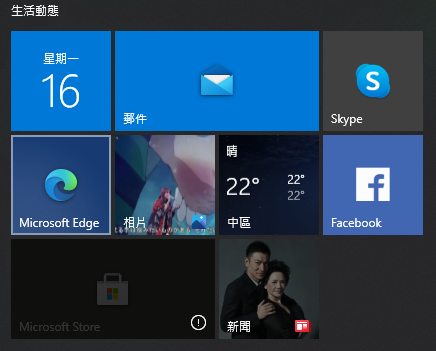

# Microsoft Store 打不開


某次更新 Windows 10 後，Microsoft Store 怎麼點他都打不開，嘗試了一些方法都失敗，記錄一下有效的方法

<!--more-->

## 症狀
Windows 動態磚上面顯示 Microsoft Store 的圖示變成這樣  


## 解法

1. 用系統管理員打開 powershell
2. 執行以下命令

    ```powershell
    Get-AppXPackage *WindowsStore* -AllUsers | Foreach {Add-AppxPackage -DisableDevelopmentMode -Register "$($_.InstallLocation)\AppXManifest.xml"}
    ```

3. 重新啟動電腦，Microsoft Store 應該就可以開了

## Reference
- [Windows Store Is Missing](https://zcom.tech/microsoft-store-wont-open-windows-10.html/#Windows_Store_Is_Missing)
- [Microsoft Store 無法啟動](https://answers.microsoft.com/zh-hant/windows/forum/windows_10-windows_store/microsoft-store/6fa35948-d185-499c-a146-6a8ef6e26409?auth=1)

