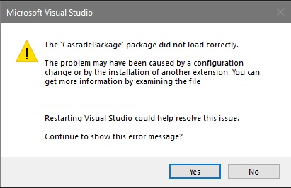

# Visual Studio 2019 16.9 打開專案跳錯誤

更新至 Visual Studio 2019 16.9 之後，打開專案會跳出 `The 'CascadePackage' package did not load correctly` 的錯誤

<!--more-->

## 症狀

([圖片來源](https://stackoverflow.com/q/66493827/1568102))

## 解決方式
打開 Visual Studio Installer => 修改，切換到`個別元件`，搜尋 `Live Share`，取消勾選後按修改，等他更新後即可

## Reference
- https://developercommunity.visualstudio.com/t/the-cascadepackage-package-did-not-load-correctly-9/1342604
- https://stackoverflow.com/a/66494411/1568102

