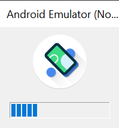
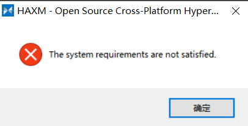

# Android Emulator 啟動無回應


升級 Flutter 後，要啟動 Android 模擬器，卻無回應，記錄一下怎麼處理這個問題的

<!--more-->

## 問題
啟動模擬器後會卡在這個讀取畫面  


## 嘗試解法 (失敗)
1. 到 Android Virtual Device Manager 刪除裝置並重建
2. 到 SDK Managr 更新 Android API 及相關 Tools

## 可能可以用的解法
1. 到 [控制台]->[程式和功能]->[開啟或關閉 Windows 功能]，將 [Hyper-V]->[Hyper-V 平台] 底下的項目都先取消，並重開機
2. 安裝 Intel HAXM (位在 `%ANDROID_SDK_ROOT%/extras/intel/Hardware_Accelerated_Execution_Manager`)
3. 若無法安裝 Intel HAXM (The System requirements are not satisfied.)  
  
可試試看用指令將 Hyper-V 停用，重開機後再安裝看看

```powershell
bcdedit /set hypervisorlaunchtype off
```

目前做了上面的步驟後 Android Emulator 就打的開了

## 其他問題
### Android Emulator 可以開但 WSL 打不開
WSL 需要 Hyper-V 啟用，目前測試再把 Hyper-V 重新啟用後，也可以正常開 WSL 跟 Android Emulator

```powershell
bcdedit /set hypervisorlaunchtype auto
```

