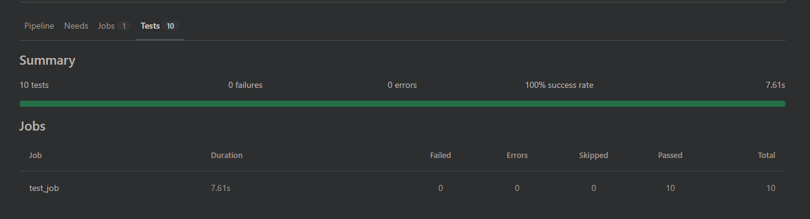

# GitLab CI 建立自動化執行 Unit Testing (NUnit)


記錄一下 GitLab CI 自動跑 Unit Test 的步驟，有踩了一些小坑

<!--more-->

## 環境

- .NET 4.5 專案
- NUnit 3.13.3
- GitLab 12.x

## NUnit Console 執行測試

nuget 加入 [NUnit.Console](https://www.nuget.org/packages/NUnit.Console/) 參考，就可以用 Console 跑測試
安裝完成後執行檔應該會在以下路徑

```batch
%USERPROFILE%\.nuget\packages\nunit.consolerunner\[Version]\tools\nunit3-console.exe
```

如果沒有的話可能會在專案目錄下面

```batch
.\packages\nunit.consolerunner\[Version]\tools\nunit3-console.exe
```

執行測試

```batch
set NUNIT_CONSOLE=%USERPROFILE%\.nuget\packages\nunit.consolerunner\3.15.0\tools\nunit3-console.exe

"%NUNIT_CONSOLE%" "Path\To\UnitTest.MyProject.dll" --work=.\TestResult
```

會在 `.\TestResult` 產生 `TestResult.xml`

## 加入自動化測試

GitLab CI [只支援 junit 格式的 test report](https://docs.gitlab.com/ee/ci/yaml/artifacts_reports.html#artifactsreportsjunit)，所以需要先將 NUnit 3 格式的 report 轉檔

下載 https://github.com/nunit/nunit-transforms/blob/master/nunit3-junit/nunit3-junit.xslt 放到專案目錄中

nunit-console 加入以下參數

```txt
--result=junit-results.xml;transform=nunit3-junit.xslt
```

GitLab CI 設定檔將 `.\TestResult\junit-results.xml` 加入 `artifacts:reports:junit` 設定

`.gitlab-ci.yml` 範例

```yml
stages:
  - build
  - test

build_job:
  stage: build
  variables:
    GIT_STRATEGY: fetch
  before_script:
    - 'CHCP 65001'
  script:
    - 'msbuild "MyProject.sln" /t:Rebuild /p:Configuration="Release" /p:Platform="Any CPU"'
  tags:
    - DOTNET_BUILD
  only:
    refs:
      - branches
  artifacts:
    when: always
    paths:
      - UnitTest/UnitTest.MyProject/bin/Release/UnitTest.MyProject.dll
    expire_in: 1 week

test_job:
  stage: test
  dependencies:
    - build_job
  variables:
    GIT_STRATEGY: fetch
  before_script:
    - 'CHCP 65001'
  script:
    - 'set NUNIT_CONSOLE=%USERPROFILE%\.nuget\packages\nunit.consolerunner\3.15.0\tools\nunit3-console.exe'
    - '"%NUNIT_CONSOLE%" "UnitTest/UnitTest.MyProject/bin/Release/UnitTest.MyProject.dll" --config=Release --work=.\TestResult --result=TestResult.xml --result=junit-results.xml;transform=nunit3-junit.xslt'
  tags:
    - DOTNET_BUILD
  only:
    refs:
      - branches
  artifacts:
    when: always
    paths:
      - TestResult/junit-results.xml
      - TestResult/TestResult.xml
    reports:
      junit: TestResult/junit-results.xml
    expire_in: 1 week
```

成功的話，每次 push 上去應該會觸發 Pipeline，Runner會建置專案並自動跑測試，最後能在介面上查看測試結果  


## Reference
- [NUnit Console 參數](https://docs.nunit.org/articles/nunit/running-tests/Console-Command-Line.html)
- [GitLab CI Test Report](https://docs.gitlab.com/ee/ci/yaml/artifacts_reports.html#artifactsreportsjunit)

