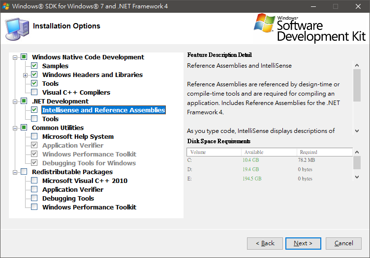
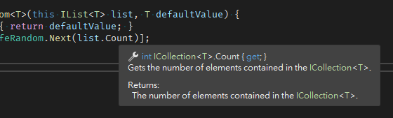

# Visual Studio .NET Framework 4.0 專案 Intellisense 文件消失


VS語系設中文的時候還有，切換成英文的時候就不見了

<!--more-->

檢查 `C:\Program Files (x86)\Reference Assemblies\Microsoft\Framework\.NETFramework\v4.0` 目錄
裡面沒有 xml 文件，但 zh-Hant 裡面有 xml 文件

根據 [StackOverflow](https://stackoverflow.com/a/45509430/1568102) 上查到的資料，下載 [Windows SDK for Windows 7 and .NET Framework 4](https://www.microsoft.com/en-us/download/details.aspx?id=8442)，Win10 x64 請下載 `GRMSDKX_EN_DVD.iso`

下載後解壓縮，執行 `Setup/SDKSetup.exe`，安裝元件勾選 `Intellisense and Reference Assemblies`  


安裝完後再次檢查上述目錄，就出現對應的 xml 文件了，這時再重開 .NET 4 專案，理論上就會出現文件說明  


---

## 4.5.2 文件消失
參考 https://stackoverflow.com/a/58960895/1568102
下載 https://www.microsoft.com/en-us/download/details.aspx?id=42637

執行 
```
NDP452-KB2901951-x86-x64-DevPack.exe /lcid 1033 /uninstall
```

選擇 `Repair`

