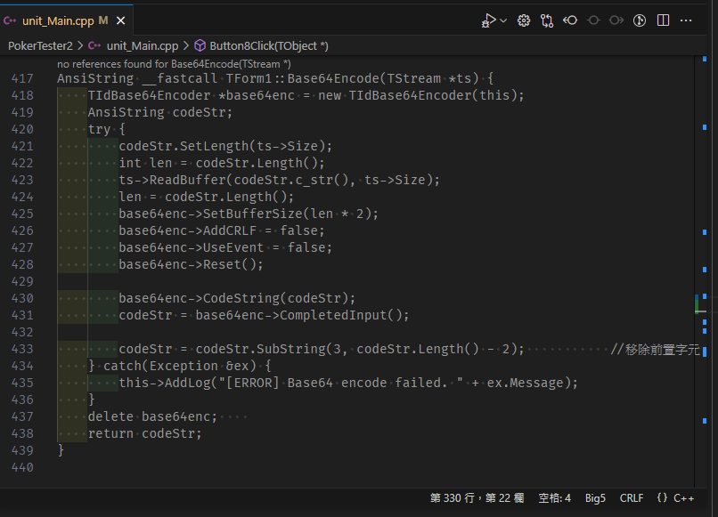
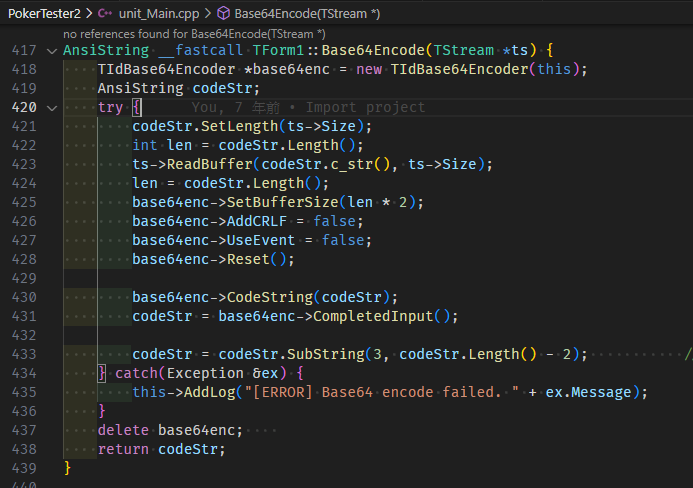

# VSCode 開啟老舊 C++ 檔案無法正確顯示標色


手邊處理舊的 BCB6 專案，只是要單純打開看跟簡單的編輯，就沒有另外用 BCB 的 IDE 打開，VSCode 的 Syntax Highlight 壞掉了

<!--more-->

似乎是因為 VSCode 的 Extension [TypeLens](https://marketplace.visualstudio.com/items?itemName=kisstkondoros.typelens) 沒辦法正確解析 BCB code 的 reference，讓它覺得所有的 code 都沒用到，就顯示為灰色了



在設定中停用 `typelens.decorateunused` 就正常了

```json
{
    "typelens.decorateunused": false
}
```



