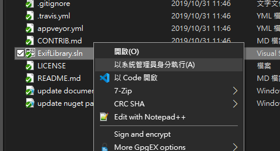
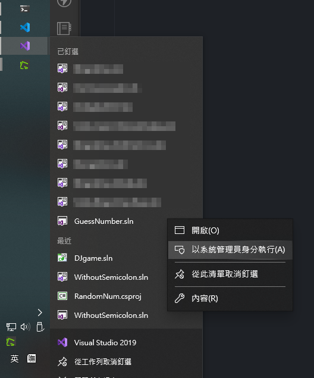

# Visual Studio 2019/2022 使用系統管理員身分打開方案檔 (*.sln)


有些專案的程式需要用系統管理員權限才能執行，以往都是先用系統管理員身分打開 Visual Studio，再手動打開方案，查了之後才發現有方法可以直接對方案檔以系統管理員身分打開

<!--more-->

打開登錄編輯程式，新增機碼
- Visual Studio 2019
  `HKEY_CLASSES_ROOT\VisualStudio.sln.267dcece\shell\RunAs\Command`
  預設值 `"C:\Program Files (x86)\Microsoft Visual Studio\2019\[VS Version]\Common7\IDE\devenv.exe" "%1"`
- Visual Studio 2022
 `HKEY_CLASSES_ROOT\VisualStudio.sln.847708e2\shell\RunAs\Command`
 預設值 `"C:\Program Files\Microsoft Visual Studio\2022\[VS Version]\Common7\IDE\devenv.exe" "%1"`

其中 `[VS Version]` 替換為 Visual Studio 的版本，比如說 `Community` 或 `Enterprise`

或是把下面內容另存成 `xxx.reg`，再雙擊執行

VS2019

```reg
Windows Registry Editor Version 5.00

[HKEY_CLASSES_ROOT\VisualStudio.sln.267dcece\shell\RunAs]
[HKEY_CLASSES_ROOT\VisualStudio.sln.267dcece\shell\RunAs\command]
@="\"C:\\Program Files (x86)\\Microsoft Visual Studio\\2019\\Community\\Common7\\IDE\\devenv.exe\" \"%1\""
```

VS2022

```reg
Windows Registry Editor Version 5.00

[HKEY_CLASSES_ROOT\VisualStudio.sln.847708e2\shell\RunAs]
[HKEY_CLASSES_ROOT\VisualStudio.sln.847708e2\shell\RunAs\command]
@="\"C:\\Program Files\\Microsoft Visual Studio\\2022\\Community\\Common7\\IDE\\devenv.exe\" \"%1\""
```

重新開機後，工作列對 Visual Studio Icon 按右鍵的專案選單，或是檔案總管對 `.sln` 檔按右鍵的選單都會出現 `以系統管理員身分執行`

Explorer 右鍵選單  


工作列右鍵選單  


## Reference
- https://stackoverflow.com/a/43942660/1568102

